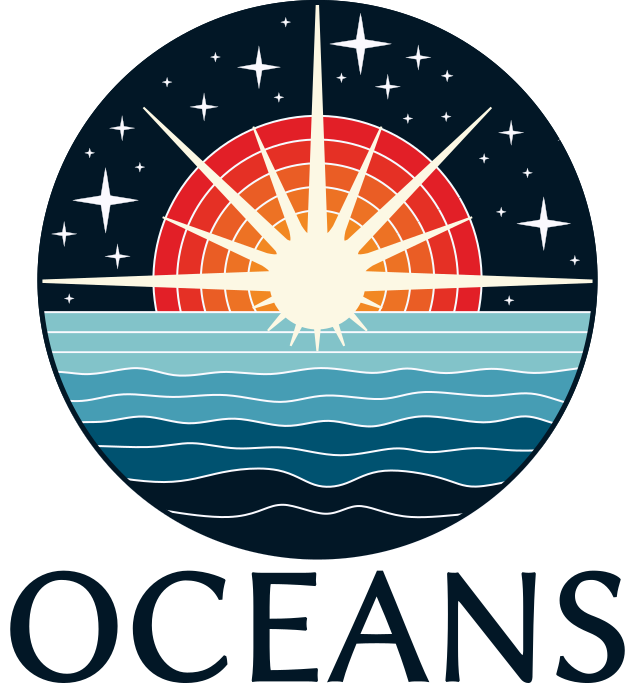

# OCEANS Stellar ML

  
  &nbsp;&nbsp;&nbsp;
  

  <em>Machine learning approaches for stellar data analysis within the OCEANS (HORIZON Europe) project</em>

---

## About the Project

**OCEANS** — *Overcoming Challenges in the Evolution And Nature of Massive Stars*  

This repository contains machine learning methods and tools, focusing on:

- Data-driven analysis of stellar spectra  
- Machine learning models for astrophysical inference  
- Tools for astrostatistics and scientific discovery  

---
